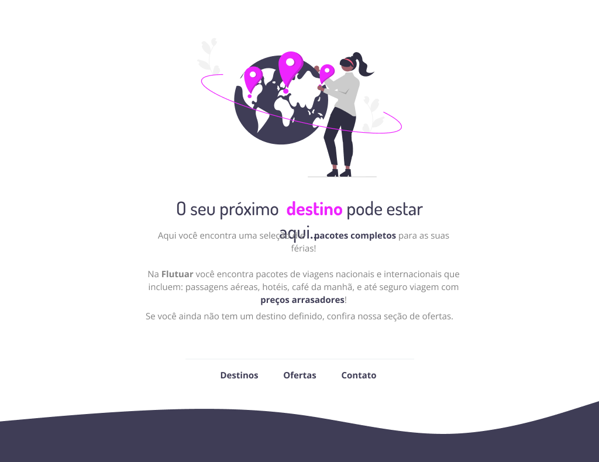

<h1 align="center"> Explorer Stage 2 </h1>

Desafio promovido pela Rocketseat para ensino de tecnologias WEB.  

  <a href="#-tecnologias">Tecnologias</a>&nbsp;&nbsp;&nbsp;|&nbsp;&nbsp;&nbsp;
  <a href="#-projeto">Projeto</a>&nbsp;&nbsp;&nbsp;|&nbsp;&nbsp;&nbsp;
    <a href="#memo-licença">Licença</a>

  

 

  

## 🚀 Tecnologias

Esse projeto foi desenvolvido com as seguintes tecnologias:

- HTML e CSS
- Figma

## 💻 Projeto

O Desafio Stage 2 é um projeto dentro do curso Explorer que visa ao aluno coloca em prática tudo que foi aprendido até então:
 Exploramos o o figma, e como a partir dele, transformar em algo palpável desenvolvendo as habilidades html e css.
 Dentro do html aprendemos que significa, quais as melhores tags, para que serve cada uma. No css exploramos a sintaxe, as propriedades e seus valores de forma a fazer o layout funcionar da maneira mais fiel.
Um projeto bem pensado para aprender sobre espaçamento, html, css, fontes, cores, bordas e posicionamentos, alinhamentos. tantas coisas importantes e usuais para a base

- [Acesse o projeto finalizado, online](https://dencunha.github.io/Projeto-st2-desafio/)

## :memo: Licença

Esse projeto está sob a licença MIT.

---

Feito por Blenda ♥ by Rocketseat :wave: [Participe da nossa comunidade!](https://discord.gg/rocketseat)